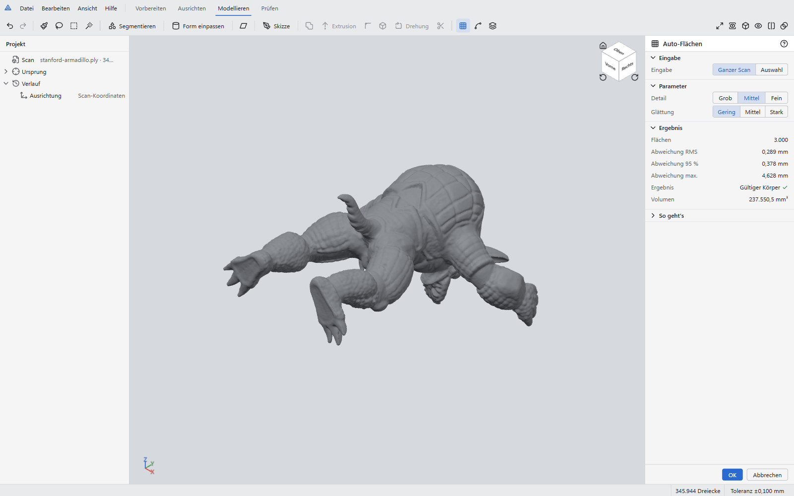
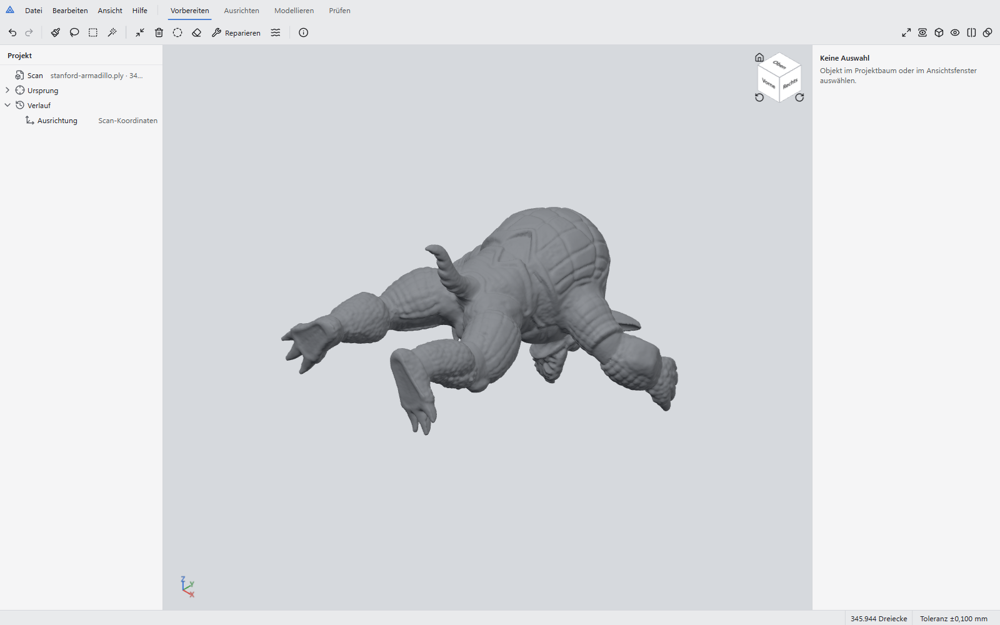
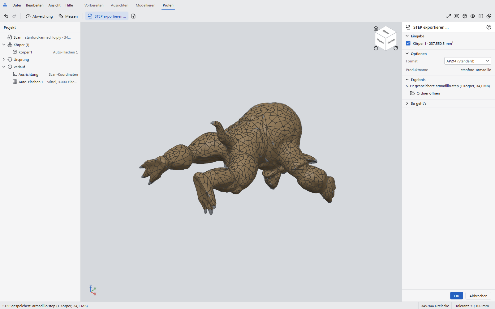

# Mesh-to-CAD

[Deutsch](README.de.md)

Mesh-to-CAD rebuilds 3D-scan meshes (STL, OBJ, PLY) as editable solid models and exports them as
STEP. It runs on Windows 10 and 11 (x64) and works offline.

**Status:** version 0.1.0, feature-complete for the scope below and tested end to end; not yet
published as a release. Measured accuracy and speed are in [docs/RESULTS.md](docs/RESULTS.md).



## What works

- **Organic scans → STEP:** _Auto-Flächen_ turns a closed scan into one valid solid made of
  B-spline patches. Stanford Armadillo (346 000 triangles): 3 000 patches in 21 s, deviation RMS
  0.29 mm on a 229 mm part; with a cylindrical hole cut through it the STEP file reads back as a
  valid solid whose freeform faces are all B-splines.
- **Technical parts → STEP:** fit planes, cylinders, cones, spheres and tori; sketch on a section
  of the scan; extrude, revolve, combine, fillet. On a noisy flange scan (σ 0.03 mm) the measured
  radii and heights are within 0.001 mm of the design values and snap to them exactly; the volume
  of the rebuilt solid is off by less than 0.0001 %.
- Everything in the list below is implemented; the 3D view shows a 2-million-triangle scan
  within 0.8 s and orbits at about 160 fps.

| Imported scan                                      | Exported body                                  |
| -------------------------------------------------- | ---------------------------------------------- |
|  |  |

## Scope of version 0.1

Version 0.1 targets prismatic and rotational parts such as brackets, flanges, adapters, cover
plates, shafts and knobs, scanned with a consumer 3D scanner.

- Import STL, OBJ and PLY scans; repair, reduce, fill small holes, remove small parts and stray
  triangles.
- Align the scan to a part coordinate system, automatically or from fitted faces.
- Select areas with brush, smart select, lasso or rectangle, or segment the scan automatically.
- Fit planes, cylinders, cones, spheres and tori, with the fit quality shown against a project
  tolerance and design values proposed from the measurement (for example "Radius 8.000 mm,
  measured 7.987 ± 0.012").
- Sketch on sections of the scan with automatically fitted lines, arcs and circles.
- Build solids with extrude, revolve, primitives, split, combine, fillet and chamfer, kept in an
  editable history.
- Measure the model and compare it with the scan in a deviation colour map.
- Export STEP (AP214 or AP242, verified by reading the file back) and STL.
- User interface in German and English.

The full scope, including what is out of scope for 0.1, is in
[docs/ARCHITECTURE.md](docs/ARCHITECTURE.md#1-product-scope).

## Requirements

- Windows 10 or 11, 64-bit.
- A GPU with WebGL 2 support (any integrated GPU from the last ten years).
- 8 GB RAM; 16 GB recommended for scans with more than one million triangles.

## Installing

Build the installer with `npm run dist` (see below); it is written to
`release\Mesh-to-CAD-0.1.0-Setup.exe`. Run it and start _Mesh-to-CAD_ from the Start menu. The
unpacked application is also available as `release\win-unpacked\Mesh-to-CAD.exe`.

## Building from source

Prerequisites: [Node.js](https://nodejs.org/) 24, [Python](https://www.python.org/) 3.12
(64-bit) and Git. No C++ compiler is needed.

```powershell
git clone https://github.com/GalusPeres/Mesh-to-CAD.git
cd Mesh-to-CAD
py -3.12 -m venv .venv
.venv\Scripts\python -m pip install -r kernel\requirements-dev.txt
npm ci
npm run dev
```

`npm run dev` starts the application with hot reload for the user interface. `npm run check`
runs all linters and tests, `npm run build; npx playwright test` the end-to-end tests, and
`npm run dist` builds the installer; [CONTRIBUTING.md](CONTRIBUTING.md) lists the individual
commands. `node scripts/py.mjs scripts/verify_scenarios.py` repeats the measurements of
[docs/RESULTS.md](docs/RESULTS.md).

## How it works

The application has three processes: the Electron main process (windows, files, security), a
sandboxed renderer (React user interface and three.js viewport) and a Python geometry process
that uses [Open CASCADE](https://dev.opencascade.org/) through
[OCP](https://github.com/CadQuery/OCP) for solid modelling and numpy/scipy for mesh processing
and fitting. They exchange binary messages over standard input and output. The design is
described in [docs/ARCHITECTURE.md](docs/ARCHITECTURE.md) and the user interface in
[docs/DESIGN.md](docs/DESIGN.md).

## Automation (MCP)

AI assistants can operate the app through a Model Context Protocol server
(`tools/mcp/server.mjs`): load a scan, align it, fit shapes, create Auto-Flächen, export
STEP and take screenshots, all live in the open window and undoable. Enable it in
**Datei → Einstellungen → Automatisierung**; setup and tools are described in
[docs/AUTOMATION.md](docs/AUTOMATION.md).

## Documentation

- [Measured results](docs/RESULTS.md)
- [Automation and MCP server](docs/AUTOMATION.md)
- [Architecture](docs/ARCHITECTURE.md)
- [Design system](docs/DESIGN.md)
- [Contributing](CONTRIBUTING.md)
- [Security policy](SECURITY.md)
- [Changelog](CHANGELOG.md)

## Licence

Mesh-to-CAD is released under the [MIT licence](LICENSE). It uses third-party components under
their own licences, listed in [THIRD_PARTY_NOTICES.md](THIRD_PARTY_NOTICES.md).

## Acknowledgements

Mesh-to-CAD builds on Open CASCADE Technology, the OCP bindings maintained by the CadQuery
project, trimesh, numpy, scipy, three.js, three-mesh-bvh, React and Electron.
